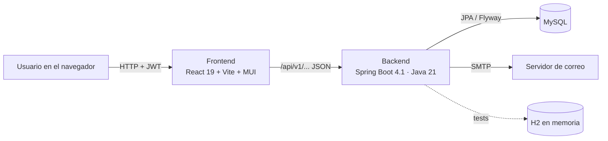
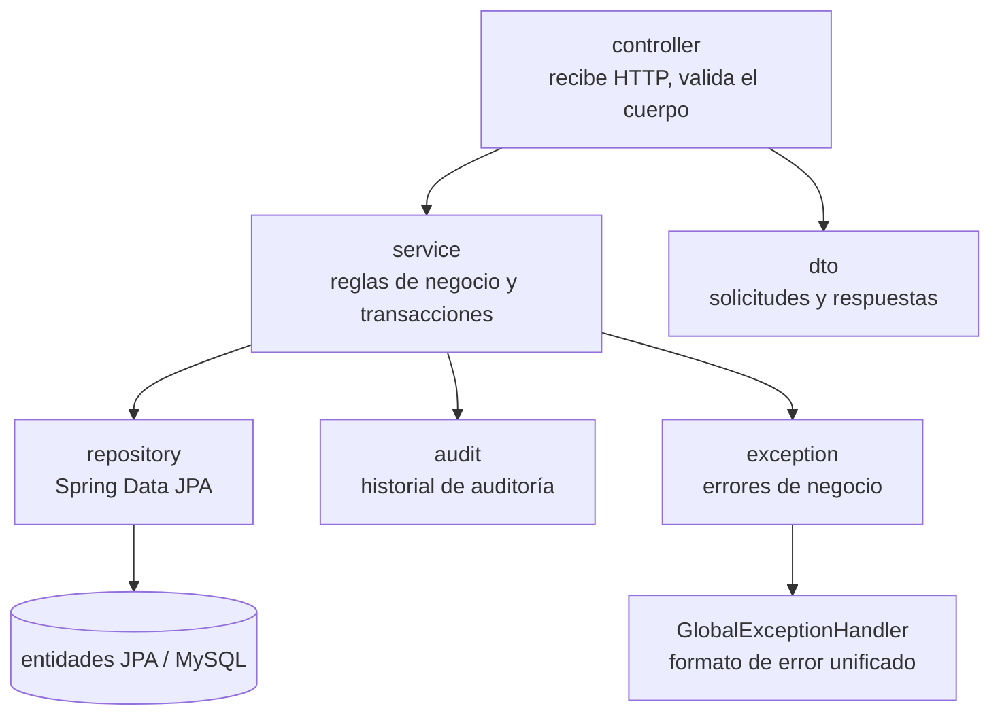
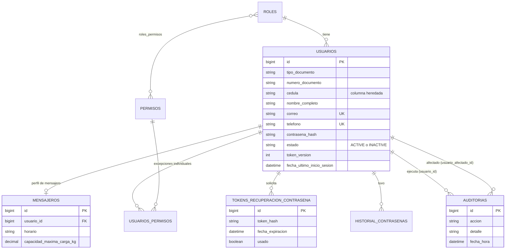
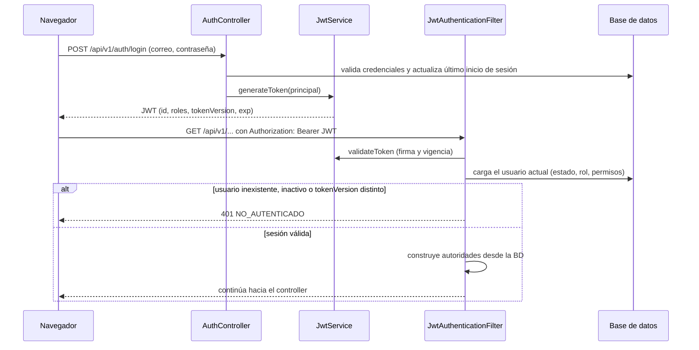
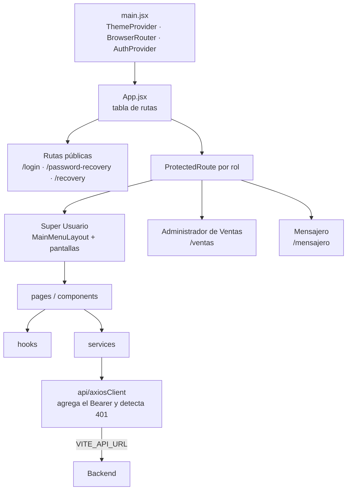

# Arquitectura de BlawdTrack

BlawdTrack es un sistema de seguimiento de paquetes y mensajeros. Este documento describe cómo está
armado el código que hoy existe en `develop`: una API REST en Spring Boot y una aplicación web en React.
Los paquetes y las entregas todavía no están construidos; lo que existe es la base de seguridad y la
gestión de usuarios (mensajeros y administradores), roles y permisos.

Para el detalle funcional de cada historia de usuario, ver [`docs/hu/`](hu/README.md).

## 1. Vista general



| Pieza | Tecnología | Carpeta |
|---|---|---|
| Frontend | React 19, Vite 8, MUI 9, React Router 7, Axios | `blawdtrack/frontend` |
| Backend | Spring Boot 4.1.1, Spring Security, Spring Data JPA, JJWT, Flyway, Lombok | `blawdtrack/backend` |
| Base de datos | MySQL (producción y desarrollo), H2 solo en pruebas | migraciones en `backend/src/main/resources/db/migration` |
| Correo | Spring Mail (SMTP) con plantillas HTML | `backend/src/main/resources/templates/mail` |

## 2. Backend por capas

El paquete raíz es `com.blawdgourmet.blawdtrack`. Cada módulo sigue la misma estructura:



| Módulo | Contenido |
|---|---|
| `auth` | Login, JWT, filtro de autenticación, recuperación de contraseña, envío de correo, siembra del Super Usuario. |
| `users` | Entidad `User`, roles, permisos, administradores (crear, listar, eliminar), matriz de permisos por rol, validación de documentos. |
| `couriers` | Mensajeros: registrar, listar, actualizar; correo de bienvenida; validación de desactivación. |
| `audit` | Registro de auditoría (`AuditLog`, `AuditService`) que otros módulos usan. |
| `common` | Manejo global de errores (`GlobalExceptionHandler`, `ApiError`, `ErrorResponse`) y el principal autenticado (`AuthenticatedUser`). |

### Reglas que atraviesan todo el backend
- **Identidad de una persona:** siempre `documentType` (`CEDULA`, `DIMEX`, `PASAPORTE`) más `documentNumber`.
  Nunca se usa un campo suelto de cédula. `DocumentNormalizer` deja el número en su forma canónica
  y `DocumentValidator` (`@ValidDocument`) valida el formato de cada tipo.
- **Inyección por constructor** (`@RequiredArgsConstructor`); nunca `@Autowired` en campos.
- **Nombres de código en inglés**; tablas, columnas y textos de negocio en español.

## 3. Modelo de datos



El esquema lo crea Flyway (`V1` a `V10`). La unicidad del documento es `(tipo_documento, numero_documento)`.

## 4. Autenticación y sesión

El backend no guarda sesiones: cada solicitud lleva un JWT firmado. Pero el filtro **no confía solo en el
token**: en cada petición consulta al usuario en la base de datos. Por eso los cambios de estado, rol y
permisos aplican en la siguiente solicitud sin emitir un token nuevo.



- **`tokenVersion`** sube cuando cambia el estado de una cuenta (`User.changeStatus`), lo que invalida al
  instante los tokens ya emitidos.
- **Autorización:** `SecurityConfig` restringe por prefijo de ruta (`/api/v1/admins/**`,
  `/api/v1/couriers/**`, `/api/v1/roles/**` son solo del Super Usuario) y los servicios lo refuerzan con
  `@PreAuthorize`. La autorización se evalúa **antes** de validar el cuerpo: un rol sin permiso recibe 403,
  no 400.

## 5. Roles y permisos

| Rol | Nombre en el sistema | Alcance |
|---|---|---|
| Super Usuario | `SUPER_USUARIO` | Gestiona mensajeros, administradores, roles y permisos. Sus permisos no se editan. |
| Administrador de Ventas | `ADMIN_VENTAS` | Opera paquetes y reportes (a construir). Permisos editables dentro de su alcance. |
| Mensajero | `MENSAJERO` | Consulta y actualiza sus paquetes asignados (a construir). Permisos editables dentro de su alcance. |

Los códigos de permiso están en `PermissionCode` y se siembran al arrancar con `RoleDataInitializer`.

## 6. Manejo de errores

Todos los errores de la API tienen la misma forma:

```json
{ "code": "TOKEN_INVALIDO", "message": "…", "status": 400, "errores": null, "timestamp": "…" }
```

| Código | Estado | Cuándo |
|---|---|---|
| `AUTH_FAILED` | 401 | Credenciales incorrectas o cuenta inactiva en el login. |
| `NO_AUTENTICADO` | 401 | Token ausente, inválido, vencido o invalidado. |
| `ACCESS_DENIED` / `ACCESO_DENEGADO` | 403 | El rol no puede ejecutar la acción (el primero lo responde el filtro de seguridad; el segundo, `@PreAuthorize` a través de `GlobalExceptionHandler`). |
| `VALIDATION_ERROR` / `VALIDATION_FAILED` | 400 | Datos inválidos (con la lista de campos). |
| `MALFORMED_REQUEST` | 400 | JSON mal formado o valor de enumeración no soportado. |
| `TOKEN_INVALIDO` | 400 | Token de recuperación inexistente, usado o vencido. |
| `CONTRASENA_REUTILIZADA` | 400 | La nueva contraseña coincide con una reciente. |
| `ADMINISTRADOR_NO_EXISTENTE` | 404 | No hay administrador con ese documento. |
| `COURIER_NOT_FOUND` | 404 | No hay mensajero con ese id o documento. |
| `ADMINISTRADOR_CON_SESION_ACTIVA` | 409 | No se puede eliminar un administrador con sesión activa. |
| `COURIER_CONFLICT` / `DUPLICATE_EMAIL` / `DOCUMENTO_DUPLICADO` | 409 | Documento, correo o teléfono ya registrados. |
| `ROLE_PERMISSIONS_ERROR` | 400/403/404 | Error al modificar los permisos de un rol. |
| `INTERNAL_ERROR` | 500 | Error inesperado (no expone detalles). |

Los textos que ve el usuario los define el frontend según el `code`; el `message` del backend no se muestra
tal cual.

## 7. Frontend



| Carpeta | Contenido |
|---|---|
| `src/api` | `axiosClient` (base URL, token en cada solicitud) y `sessionExpiry` (puente entre el interceptor y React). |
| `src/context`, `src/hooks` | `AuthProvider` (sesión y usuario) y hooks de datos (`useAuth`, `useCourier`, `useDeactivateMessenger`). |
| `src/services` | Una función por endpoint del backend. Ninguna pantalla llama a Axios directamente. |
| `src/pages`, `src/components` | Pantallas y piezas reutilizables (modales, avisos, selectores de rueda, menú lateral). |
| `src/config` | Rutas, roles, navegación por rol y catálogo de la matriz de permisos. |
| `src/utils` | Lógica pura y probada: errores de login, almacenamiento de sesión, validaciones, reglas de contraseña. |

- **Sesión:** el token y el perfil se guardan en `localStorage`. Al vencer o recibir un 401
  `NO_AUTENTICADO`, `AuthProvider` limpia la sesión y `ProtectedRoute` redirige a `/login` con un aviso.
- **Menú por rol:** `getNavigationForRole` filtra los grupos según el rol; una pantalla sin ruta se muestra
  deshabilitada ("Disponible próximamente").
- **Textos:** todo lo que ve el usuario está en español; identificadores y comentarios técnicos, según la
  convención del repositorio.

## 8. Pruebas

- **Backend:** JUnit 5, Mockito, AssertJ y MockMvc sobre H2 en memoria. Ver el README del backend.
- **Frontend:** Vitest, jsdom y Testing Library. Ver el README del frontend.
