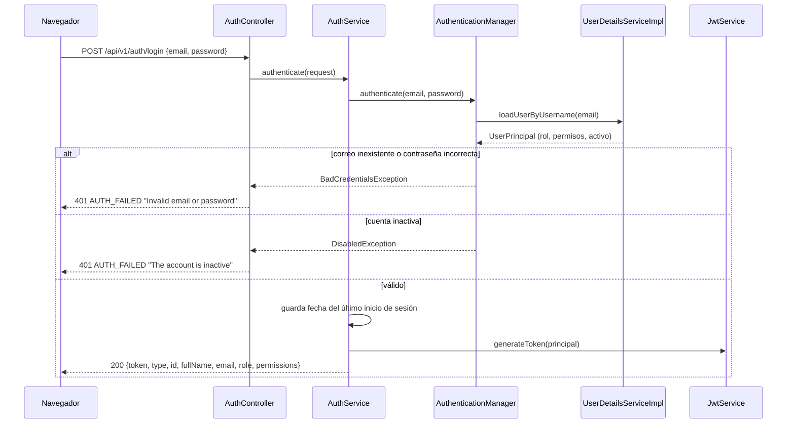
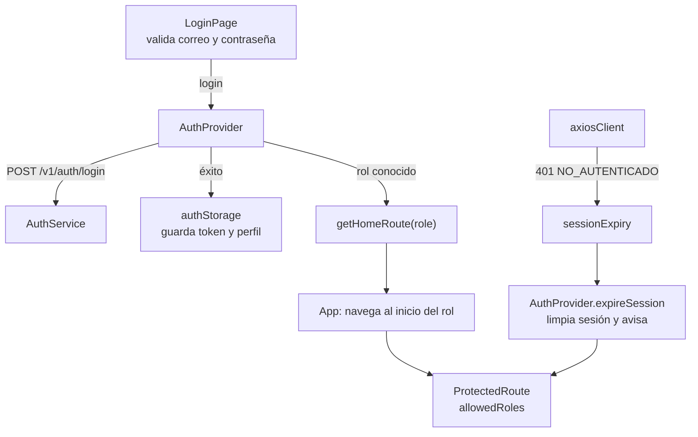

# HU001 · Inicio de sesión y control de acceso por rol

**Rama de correcciones:** `fix/hu001/criterios-aceptacion/silesky` (ID Azure DevOps #3), aún no fusionada.

## Resumen

El usuario entra con su correo y contraseña, recibe un JWT y es llevado a su pantalla de inicio según su
rol. Cada rol solo ve las rutas que le corresponden. La sesión termina al cerrar sesión, al vencer el
token o cuando el backend la invalida (por ejemplo, al desactivar la cuenta).

> Los criterios oficiales de esta HU no se guardaron en el repositorio. Lo que sigue describe lo que el
> código hace en `develop`.

## Comportamiento en `develop`

| Comportamiento | Estado |
|---|---|
| Login con correo y contraseña; devuelve token, datos del usuario, rol y permisos | ✅ |
| Credenciales incorrectas → 401 con un mensaje que no revela qué dato falló | ✅ |
| Cuenta inactiva → 401 con un mensaje propio | ⚠️ El `code` es el mismo (`AUTH_FAILED`); el frontend las distingue por el texto del mensaje |
| Redirección por rol (Super Usuario y Ventas → `/main-menu`, cada uno con su menú; Mensajero → `/mensajero`) | ✅ |
| Rutas protegidas por rol; un rol no permitido vuelve a su propio inicio | ✅ |
| Sesión vencida o rechazada: se limpia y se avisa en el login | ✅ |
| Cambios de estado, rol y permisos aplican en la siguiente solicitud | ✅ |

## Cómo funciona en el backend

**Verificación del token en cada solicitud.** `JwtAuthenticationFilter` valida la firma y la vigencia,
carga al usuario desde la base y rechaza con 401 `NO_AUTENTICADO` si el usuario no existe, está inactivo,
el id del token no coincide o `tokenVersion` cambió. Así la sesión de una cuenta desactivada se cierra sin
esperar a que el token venza.

**Roles.** `SecurityConfig` deja públicas solo las rutas de `/api/v1/auth/**` (y la documentación); todo lo
demás exige autenticación, y los prefijos de administración exigen rol Super Usuario.

## Cómo funciona en el frontend

- **`LoginPage`** valida en el cliente (correo con formato válido, contraseña obligatoria) y no llama al
  backend si hay errores.
- **`AuthProvider`** guarda la sesión (`authStorage`), restaura el usuario al recargar la página y rechaza
  cualquier rol que el frontend no reconozca.
- **`getLoginError`** convierte la respuesta del backend en el aviso de la pantalla. El texto lo define el
  frontend, no el `message` del backend.
- **`ProtectedRoute`** protege cada grupo de rutas con `allowedRoles`; un usuario con token vencido es
  enviado a `/login` con el aviso de sesión expirada.
- **Menú:** `getNavigationForRole` muestra solo lo que el rol puede ver.

## Clases y archivos

### Backend

| Clase | Rol |
|---|---|
| `auth.controller.AuthController` | Endpoint `POST /api/v1/auth/login` y traducción de errores de autenticación. |
| `auth.service.AuthService` | Autentica, registra el último inicio de sesión y arma la respuesta. |
| `auth.security.JwtService` | Emite y valida el JWT (firma, vigencia, `tokenVersion`). |
| `auth.security.JwtAuthenticationFilter` | Valida el token y al usuario actual en cada solicitud. |
| `auth.security.UserDetailsServiceImpl`, `UserPrincipal` | Cargan al usuario y exponen rol y permisos como autoridades. |
| `auth.security.RestAuthenticationEntryPoint`, `RestAccessDeniedHandler` | Respuestas 401 y 403 en el formato de error unificado. |
| `auth.config.SecurityConfig` | Cadena de seguridad, CORS y reglas por ruta. |
| `auth.config.DataSeeder` | Crea el Super Usuario de desarrollo. |
| `auth.dto.LoginRequest`, `LoginResponse` | Contrato del login. |
| `users.model.User`, `UserStatus` | Cuenta, estado y `tokenVersion`. |

### Frontend

| Archivo | Rol |
|---|---|
| `pages/LoginPage.jsx` | Formulario de inicio de sesión. |
| `context/AuthContext.jsx`, `hooks/useAuth.js` | Estado de sesión compartido. |
| `services/AuthService.js` | Llamada al login. |
| `utils/authStorage.js`, `utils/authErrors.js`, `utils/roleRoutes.js` | Sesión guardada, mensajes de error y rutas por rol. |
| `api/axiosClient.js`, `api/sessionExpiry.js` | Token en cada solicitud y cierre de sesión ante un 401. |
| `components/ProtectedRoute.jsx`, `config/navigation.js`, `components/layout/*` | Protección de rutas y menú por rol. |

## Pruebas

### Backend

| Test | Qué verifica |
|---|---|
| `AuthenticationIntegrationTest` | Credenciales válidas generan token; correo inexistente y contraseña incorrecta dan el mismo error; cuenta inactiva; enviar el hash como contraseña no autentica; el login devuelve rol y permisos sembrados de cada rol; entradas inválidas no generan token. |
| `JwtIntegrationTest` | El JWT está firmado y tiene expiración; los permisos, el rol y el estado se leen de la base en cada solicitud; deja de servir si el usuario se elimina; tokens y cabeceras inválidos no dan acceso. |
| `SessionInvalidationIntegrationTest` | Desactivar una cuenta invalida su token (401) al instante; reactivarla no revive el token viejo pero un login nuevo sí funciona; repetir el estado no sube la versión. |
| `AuthServiceTest` | El login actualiza solo la fecha del último inicio de sesión. |
| `UserDetailsServiceImplTest` | Carga de usuario existente, inexistente e inactivo. |
| `UserRepositoryTest` | Búsqueda por correo trae el rol y sus permisos. |

### Frontend

| Test | Qué verifica |
|---|---|
| `authErrors.test.js` | Cada respuesta de login fallido produce el aviso correcto sin revelar qué dato falló. |
| `authStorage.test.js` | Guardar, leer y limpiar la sesión; datos corruptos; token vencido. |
| `roleRoutes.test.js` | Inicio de cada rol y rechazo de roles desconocidos. |
| `AuthContext.test.jsx`, `AuthContext.session.test.jsx` | Guardar y restaurar la sesión; un 401 de sesión limpia el usuario y avisa, sin pisar el error de credenciales. |
| `sessionExpiry.test.js` | Qué 401 cuentan como "sesión expirada" y cuáles no. |
| `ProtectedRoute.test.jsx` | Redirección sin sesión, con token vencido y por rol; sin bucles. |
| `navigation.test.js`, `MainMenuLayout.test.jsx`, `MobileBottomNav.test.jsx`, `MainMenuPage.test.jsx` | Menú por rol, navegación y cierre de sesión. |
| `App.test.jsx`, `App.routes.test.jsx` | Rutas públicas y protegidas, y consistencia del inicio de cada rol. |

## Cambios pendientes en el PR abierto

- Códigos de error distintos para credenciales inválidas (`INVALID_CREDENTIALS`) y cuenta inactiva
  (`ACCOUNT_INACTIVE`), y el frontend los consume.
- Redirección a HTTPS cuando el servidor termina TLS directamente.
- Documentación del riesgo aceptado de guardar el JWT en `localStorage` (XSS).
