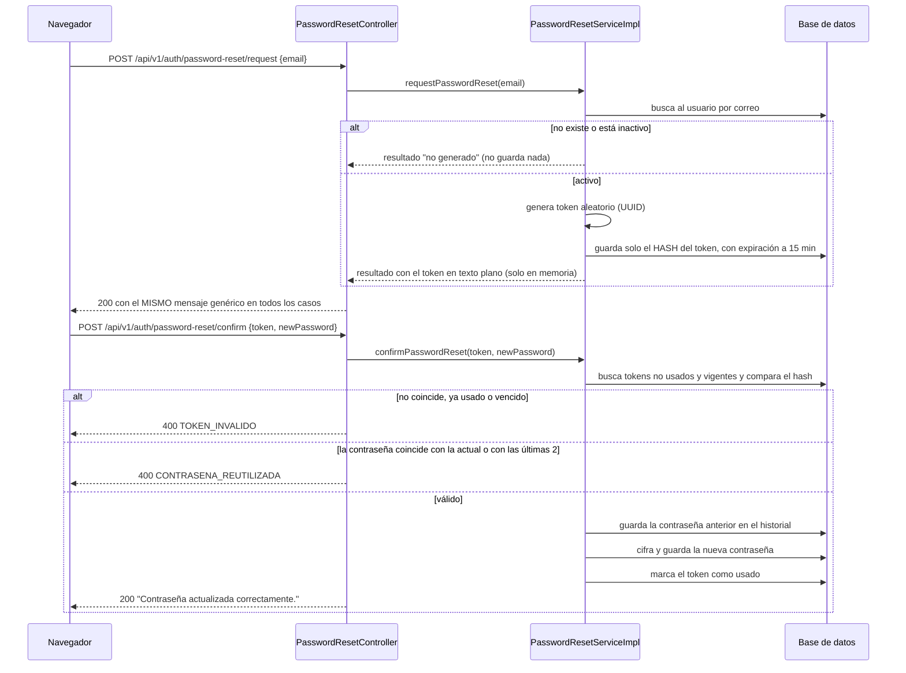
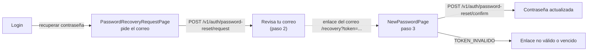

# HU002 · Recuperación de contraseña

**Rama de correcciones:** `fix/hu002/criterios-aceptacion/silesky` (ID Azure DevOps #4), aún no fusionada.

## Resumen

Un usuario que olvidó su contraseña pide un enlace por correo, lo abre y define una contraseña nueva. El
enlace lleva un token de un solo uso que vence a los 15 minutos.

## Criterios de aceptación

| Criterio | Estado en `develop` |
|---|---|
| El sistema valida que la cuenta no esté inactiva antes de enviar el correo | ❌ La validación existe, pero el correo **nunca se envía** desde este flujo (ver "Limitaciones") |
| Contraseña de mínimo 8 caracteres que combine letras y números | ⚠️ El backend lo cumple; el frontend exige además una mayúscula |
| El token tiene un tiempo de expiración y queda invalidado al usarse con éxito | ✅ Vence a los 15 minutos y se marca como usado al confirmar |

## Cómo funciona en el backend

Puntos importantes:

- **Anti-enumeración:** la solicitud responde siempre 200 con el mismo mensaje, exista o no el correo y esté
  o no activa la cuenta.
- **El token no se guarda en texto plano:** solo su hash (`PasswordEncoder`). Para confirmar se comparan
  los tokens vigentes bajo bloqueo pesimista (`PESSIMISTIC_WRITE`) para que dos confirmaciones
  simultáneas no usen el mismo token.
- **Historial:** al restablecer, la contraseña reemplazada se guarda en `historial_contrasenas`; la nueva
  no puede coincidir con la actual ni con las dos anteriores.
- **Formato de la contraseña:** `@Pattern("^(?=.*[A-Za-z])(?=.*\\d).{8,}$")` en `PasswordResetConfirmRequest`.
- **Correo:** `EmailService.sendEmailWithToken` arma el enlace `MAIL_LINK_URL?token=...` y envía un correo
  multipart (texto y HTML) con la plantilla `templates/mail/email-with-token.html`.

## Cómo funciona en el frontend

- **`PasswordRecoveryRequestPage`:** valida el correo (obligatorio y con formato) y muestra siempre la
  confirmación "Revisa tu correo", que no distingue si la cuenta existe.
- **`NewPasswordPage`:** lee el token de la URL, valida la contraseña con `PasswordRequirements` y confirma con
  `confirmPasswordReset`. Tiene tres vistas: formulario, éxito y "enlace no válido".
- **`PasswordRequirements`:** lista de requisitos en vivo. La regla "distinta de las últimas 3 contraseñas"
  queda neutra porque el cliente no la puede conocer; solo pasa a "no cumplida" si el backend responde
  `CONTRASENA_REUTILIZADA`.
- **`RecoverySteps`:** indicador de los tres pasos. Las rutas públicas son `/password-recovery` y `/recovery`;
  el Super Usuario también llega desde el menú lateral ("Restablecer contraseña").

## Clases y archivos

### Backend

| Clase | Rol |
|---|---|
| `auth.controller.PasswordResetController` | Endpoints de solicitud y confirmación. |
| `auth.service.PasswordResetService`, `impl.PasswordResetServiceImpl` | Reglas: cuenta activa, token, expiración, historial. |
| `auth.service.PasswordResetResult` | Resultado interno (token en claro solo en memoria). |
| `auth.service.EmailService` | Envío del correo con el enlace. |
| `auth.entity.PasswordResetToken`, `PasswordHistory` | Tablas `tokens_recuperacion_contrasena` e `historial_contrasenas`. |
| `auth.repository.PasswordResetTokenRepository`, `PasswordHistoryRepository` | Acceso a datos. |
| `auth.dto.PasswordResetRequestDTO`, `PasswordResetConfirmRequest`, `PasswordResetResponseDTO` | Contratos. |
| `auth.exception.InvalidResetTokenException`, `PasswordReusedException` | Errores de negocio (400). |

### Frontend

| Archivo | Rol |
|---|---|
| `pages/PasswordRecoveryRequestPage.jsx`, `pages/NewPasswordPage.jsx` | Pantallas del flujo. |
| `components/RecoverySteps.jsx`, `components/PasswordRequirements.jsx` | Indicador de pasos y lista de requisitos. |
| `services/PasswordRecoveryService.js` | Llamadas a los dos endpoints. |
| `utils/passwordRules.js` | Reglas de contraseña que el cliente puede validar. |

## Pruebas

### Backend

| Test | Qué verifica |
|---|---|
| `PasswordResetServiceImplTest` | Con correo existente y activo se genera y guarda el token (solo su hash); con correo inexistente o cuenta inactiva no se guarda nada. |
| `PasswordResetConfirmIntegrationTest` | Confirmar actualiza la contraseña, guarda el historial y consume el token; token inexistente, reutilizado o vencido dan el mismo error genérico; formato inválido da validación; reutilizar la contraseña actual o una de las dos últimas da error específico. |
| `EmailServiceTest`, `EmailServiceSmtpTest`, `BrevoConfigurationTest` | Armado del correo (enlace con el token codificado, HTML escapado), entrega por SMTP local y carga del perfil de correo. |

### Frontend

| Test | Qué verifica |
|---|---|
| `PasswordRecoveryRequestPage.test.jsx` | Validación del correo, envío sin espacios, confirmación neutra y avisos de error. |
| `NewPasswordPage.test.jsx` | Validaciones del cliente, envío del token y la contraseña, y cada respuesta del backend (`TOKEN_INVALIDO`, `CONTRASENA_REUTILIZADA`, `VALIDATION_ERROR`, sin conexión). |
| `PasswordRecoveryService.test.js` | Contrato de los dos endpoints y propagación de errores. |
| `passwordRules.test.js` | Cada regla de contraseña por separado. |

## Limitaciones conocidas en `develop`

- `PasswordResetController` llama a `requestPasswordReset` pero ignora el resultado y nadie llama a
  `EmailService.sendEmailWithToken`: el usuario no recibe el correo.
- El frontend exige una mayúscula en la contraseña; el criterio y el backend piden solo letras y números.

## Cambios pendientes en el PR abierto

- El servicio envía el correo (solo a cuentas activas); un fallo SMTP se registra sin romper la respuesta genérica.
- El frontend se alinea con el backend: letras y números, sin exigir mayúscula.
- Nombres de clases y métodos en inglés (`InvalidResetTokenException`, `PasswordReusedException`,
  `findActiveForUpdate`); los `code` de error se mantienen en español porque el frontend los consume.

## Restablecer la propia contraseña con la sesión iniciada

Además de la recuperación pública del login, cualquier rol autenticado (Super Usuario, Administrador de
Ventas y Mensajero) puede restablecer **su propia** contraseña:

- **Backend:** `POST /api/v1/auth/password-reset/request-own` (exige sesión, cualquier rol). No recibe
  correo: usa el de la cuenta autenticada, así que nadie puede pedir el enlace de otra cuenta. Borra los
  enlaces anteriores de esa cuenta y genera uno nuevo. Si el correo no puede enviarse responde
  `503 CORREO_NO_ENVIADO` y no deja ningún token guardado; a diferencia de la recuperación pública, aquí no
  hay riesgo de enumerar correos y el fallo se le informa al usuario.
- **Frontend:** la pantalla `OwnPasswordResetPage` muestra el correo de la cuenta y un botón "Enviarme el
  enlace", sin campo de correo. El Super Usuario y el Administrador de Ventas entran desde el menú lateral
  ("Seguridad y acceso" → "Restablecer contraseña", `/main-menu/restablecer-contrasena`); el Mensajero, desde el
  botón de su pantalla de inicio (`/mensajero/restablecer-contrasena`).
- El enlace del correo lleva a `/recovery?token=...`, la misma pantalla de nueva contraseña de la
  recuperación pública, y vence a los 15 minutos.
- **Requisito de entorno:** el correo solo sale si el backend tiene un servidor SMTP configurado
  (`MAIL_HOST`, `MAIL_PORT`, ... o el perfil `brevo`). Con el valor por defecto (`localhost:1025`) y sin un
  servidor escuchando, la pantalla muestra el error de envío.
