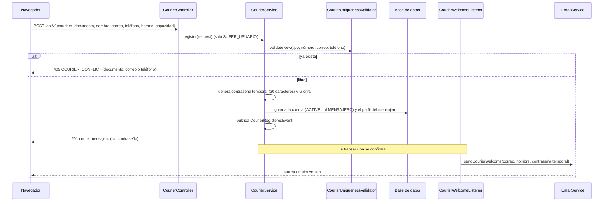

# HU003 · Registro de mensajeros

**Rama de correcciones:** `fix/hu003/criterios-aceptacion/silesky` (ID Azure DevOps #5), aún no fusionada.

## Resumen

El Super Usuario registra a un mensajero con su documento, nombre, correo, teléfono, horario y capacidad
máxima de carga. El sistema crea la cuenta activa con rol Mensajero, genera una contraseña temporal y se la
envía por correo. El mensajero puede entrar con ese correo y esa contraseña.

## Criterios de aceptación

| Criterio | Estado en `develop` |
|---|---|
| Solo el Super Usuario puede registrar mensajeros | ✅ |
| Se crea con estado "Activo" y el rol operativo por defecto | ✅ |
| Se envía automáticamente un correo con la contraseña inicial temporal | ✅ |
| El mensajero puede acceder con el correo y la contraseña asignados | ✅ |
| La capacidad máxima de carga es un valor numérico positivo | ✅ |
| Cédula, correo y teléfono son únicos (sin registros duplicados) | ⚠️ Se valida, pero el documento no se normaliza: `1-2345-6789` y `123456789` cuentan como distintos |
| Se acepta cédula, DIMEX o pasaporte **validando el formato de cada tipo** | ❌ El backend no valida el formato del documento del mensajero |
| Se puede seleccionar el tipo de documento | ✅ Selector con ejemplo por tipo |

## Cómo funciona en el backend

- **Una transacción, dos registros:** la cuenta (`usuarios`) y el perfil (`mensajeros`) se guardan juntos; si
  falla el perfil se revierte también la cuenta.
- **Correo después del commit:** `CourierWelcomeListener` escucha el evento con
  `@TransactionalEventListener(AFTER_COMMIT)`. Si el registro se revierte no sale correo; si el correo falla
  la cuenta se conserva y solo se registra el error, sin credenciales.
- **Contraseña temporal:** `TemporaryPasswordGenerator` usa `SecureRandom`, 20 caracteres con mayúscula,
  minúscula, dígito y símbolo. Solo se guarda su hash y nunca aparece en la respuesta.
- **Autorización:** `SecurityConfig` (`/api/v1/couriers/**`) y `@PreAuthorize` en el servicio, evaluados antes
  de validar el cuerpo: un rol sin permiso recibe 403, no 400.
- **Datos:** el constructor de `CreateCourierRequest` recorta espacios, pasa el correo a minúsculas y deja el
  teléfono vacío como nulo. `maxPackageWeightKg` debe ser positivo (hasta 8 enteros y 2 decimales).

## Cómo funciona en el frontend

- **`CourierRegistrationPage`** (`/main-menu/couriers/new`): formulario con nombre, teléfono, correo, tipo y
  número de documento, horario y capacidad. El tipo de documento es un selector (cédula, DIMEX, pasaporte) y
  el campo del número muestra un ejemplo distinto para cada tipo.
- **`TimeWheelField`** elige la hora de entrada y de salida con tres ruedas y compone el texto del horario;
  **`WeightWheelField`** elige la capacidad de 1 a 800 kg.
- **Validación en el cliente** (`validateCourierForm`): campos obligatorios, correo con formato, horario con
  salida posterior a la entrada y peso positivo. No valida el formato del documento: eso lo decide el backend.
- **Errores del backend** (`normalizeCourierError`): los convierte en mensajes bajo cada campo (por ejemplo
  "Este correo electrónico ya está registrado") o en una alerta global (sin conexión, sesión vencida, sin
  permisos).
- **Éxito:** muestra el correo al que se envió la contraseña y limpia el formulario.

## Clases y archivos

### Backend

| Clase | Rol |
|---|---|
| `couriers.controller.CourierController` | `POST /api/v1/couriers` y manejo de errores del módulo. |
| `couriers.service.CourierService` | `register`: unicidad, cuenta, perfil y evento. |
| `couriers.service.CourierUniquenessValidator` | Unicidad de documento, correo y teléfono. |
| `couriers.service.TemporaryPasswordGenerator` | Contraseña temporal. |
| `couriers.service.CourierRegisteredEvent`, `CourierWelcomeListener` | Correo de bienvenida tras el commit. |
| `couriers.service.SmtpFailureDiagnostic` | Describe un fallo SMTP sin exponer respuestas del proveedor. |
| `auth.service.EmailService` + `templates/mail/courier-welcome.html` | Envío del correo. |
| `couriers.model.Courier`, `couriers.repository.CourierRepository` | Perfil del mensajero (tabla `mensajeros`). |
| `couriers.dto.CreateCourierRequest`, `CourierResponse` | Contratos. |
| `couriers.service.DuplicateCourierException` | Conflicto de unicidad (409). |

### Frontend

| Archivo | Rol |
|---|---|
| `pages/CourierRegistrationPage.jsx` | Formulario. |
| `components/TimeWheelField.jsx`, `components/WeightWheelField.jsx` | Selectores de rueda para horario y capacidad. |
| `hooks/useCourier.js`, `services/CourierService.js` | Envío del formulario y llamada al endpoint. |
| `utils/courierFormValidation.js`, `utils/courierErrors.js` | Validación del cliente y traducción de errores. |

## Pruebas

### Backend

| Test | Qué verifica |
|---|---|
| `CourierRegistrationTest` | El Super Usuario crea la cuenta activa con rol fijo y contraseña cifrada; otros roles y solicitudes sin token se rechazan; un mensajero registrado puede iniciar sesión pero no registrar otros; si falla el perfil se revierte la cuenta; duplicados de documento y correo dan 409 sin crear perfil; el teléfono repetido tiene mensaje propio y el vacío se guarda como nulo; datos inválidos no crean usuarios; el correo no sale antes del commit y, si el SMTP falla, la cuenta se conserva. |
| `CourierCredentialsIntegrationTest` | La contraseña recibida por correo permite el login y es distinta para cada mensajero. |
| `CourierAuthorizationBeforeValidationTest`, `CourierHttpAuthorizationTest` | La autorización (403/401) se decide antes que la validación del cuerpo, también por HTTP real. |
| `CourierPersistenceTest`, `CourierMigrationTest` | El perfil se guarda y valida en el modelo y en la base (horario y capacidad), un perfil por cuenta, y la migración conserva a los usuarios existentes. |
| `TemporaryPasswordGeneratorTest` | Las contraseñas son distintas, con todos los grupos de caracteres y compatibles con BCrypt. |
| `SmtpFailureDiagnosticTest` | Un fallo SMTP se describe sin exponer la respuesta del proveedor. |

### Frontend

| Test | Qué verifica |
|---|---|
| `CourierRegistrationPage.test.jsx` | Mensaje de éxito con el correo y limpieza del formulario; error de correo duplicado bajo el campo; alerta global sin conexión. |
| `courierFormValidation.test.js` | Formulario válido, teléfono opcional, tipo de documento obligatorio, correo con espacios, decimales y orden del horario. |
| `courierErrors.test.js` | Cada respuesta de error (validación, conflicto, 401, 403, 5xx, sin red) se traduce al mensaje correcto. |

## Limitaciones conocidas en `develop`

- `CreateCourierRequest` no implementa `DocumentHolder` ni usa `@ValidDocument`: cualquier texto pasa como
  cédula, DIMEX o pasaporte, y el documento no se normaliza.

## Cambios pendientes en el PR abierto

- El documento del mensajero se valida por tipo (cédula y DIMEX de 9 a 12 dígitos; pasaporte de 5 a 15
  caracteres con al menos una letra) y se guarda normalizado, igual que el de los administradores.
- Tests nuevos de formato inválido por tipo y de duplicado con distinto formato.
