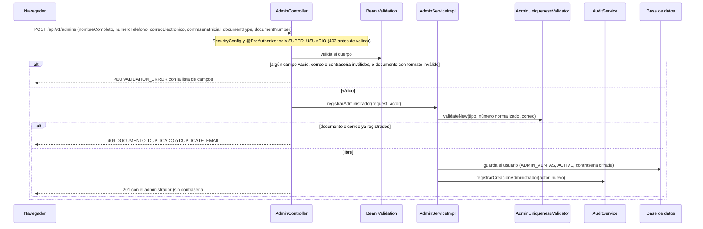

# HU006 · Creación de administradores

**Rama de correcciones:** ninguna. La revisión de criterios no encontró cambios pendientes en el backend; el
formulario del frontend está en las ramas `feature/hu006/t04/silesky` y `feature/hu006/t05/silesky`, aún no
fusionadas.

## Resumen

El Super Usuario crea un administrador de ventas con su documento, nombre, teléfono, correo y contraseña
inicial. Toda creación queda registrada en el historial de auditoría.

Guía de pruebas manuales y ejemplos de cuerpo: [`docs/HU006-Task85-pruebas.md`](../HU006-Task85-pruebas.md).

## Criterios de aceptación

| Criterio | Estado en `develop` |
|---|---|
| Solo el Super Usuario puede crear administradores | ✅ |
| Ninguno de los campos del formulario puede estar vacío | ✅ Backend. ⏳ Formulario: está en las ramas `t04`/`t05` |
| El documento (cédula, DIMEX o pasaporte) tiene un formato válido según su tipo | ✅ |
| Toda creación queda registrada en el historial de auditoría | ✅ |

## Cómo funciona en el backend

- **Campos obligatorios:** los seis campos del cuerpo llevan `@NotBlank` o `@NotNull`.
- **Documento:** `AdminRegistrationRequest` implementa `DocumentHolder` y se valida con `@ValidDocument`.
  Cédula y DIMEX aceptan de 9 a 12 dígitos; el pasaporte, de 5 a 15 caracteres alfanuméricos con al menos una
  letra. `DocumentNormalizer` quita espacios y guiones de la cédula y pone el pasaporte en mayúsculas antes de
  validar y guardar, así que `1-2345-6789` y `123456789` son el mismo documento.
- **Unicidad:** el mismo número puede existir bajo tipos distintos; el correo se compara sin distinguir
  mayúsculas.
- **Contraseña inicial:** mínimo 8 caracteres con letras y números; se guarda cifrada.
- **Auditoría:** `AuditServiceImpl.registrarCreacionAdministrador` guarda un registro `CREAR_ADMINISTRADOR`
  con el actor, el administrador afectado, la fecha y un texto con quién creó a quién.

## Cómo funciona en el frontend

En `develop` **no existe** la pantalla de creación: el ítem "Crear administrador" del menú tiene
`path: null` y aparece deshabilitado ("Disponible próximamente"). La pantalla (formulario, validación de los
seis campos obligatorios y conexión con la API) está en las ramas `feature/hu006/t04/silesky` y
`feature/hu006/t05/silesky`.

## Clases y archivos

### Backend

| Clase | Rol |
|---|---|
| `users.controller.AdminController` | `POST /api/v1/admins` (también lista y elimina). |
| `users.service.AdminService`, `impl.AdminServiceImpl` | `registrarAdministrador`. |
| `users.service.AdminUniquenessValidator` | Unicidad de documento y correo. |
| `users.dto.AdminRegistrationRequest`, `AdminRegistrationResponse` | Contrato. |
| `users.validation.DocumentHolder`, `ValidDocument`, `DocumentValidator`, `DocumentNormalizer` | Formato y normalización del documento. |
| `audit.service.AuditService`, `impl.AuditServiceImpl`, `audit.model.AuditLog` | Registro de la creación. |

## Pruebas

| Test | Qué verifica |
|---|---|
| `AdminRegistrationValidationTest` | Alta válida; correo inválido; documento inválido con el campo reportado; el tipo de documento es obligatorio; documento duplicado aunque cambien los separadores; correo duplicado sin distinguir mayúsculas; el mismo número con otro tipo se permite; otros roles quedan prohibidos; se exige token. |
| `AdminRegistrationAuthorizationIntegrationTest` | Los roles operativos reciben 403 aunque el cuerpo sea inválido; sin token, 401; el Super Usuario con cuerpo inválido sí recibe la validación. |
| `AdminCreationAuditTest` | Crear un administrador genera un registro con actor, afectado y fecha; un documento o correo duplicado, un cuerpo inválido o un actor sin permiso no generan registro. |
| `DocumentValidatorTest`, `DocumentNormalizerTest` | Formatos válidos e inválidos por tipo, aceptación de nulos y normalización de cada tipo. |

## Limitaciones conocidas

- Los nombres del cuerpo están en español (`nombreCompleto`, `correoElectronico`...) porque ese es el contrato
  que usa el formulario.
- En el backend no hay un test que pruebe cada campo vacío por separado ni los formatos inválidos de DIMEX y
  pasaporte para administradores (el validador de documentos sí está probado por separado en
  `DocumentValidatorTest`). La validación de campos obligatorios en el formulario tiene sus tests en la rama
  `feature/hu006/t05/silesky` (`AdminRegistrationPage.test.jsx`, `adminErrors.test.js`).
