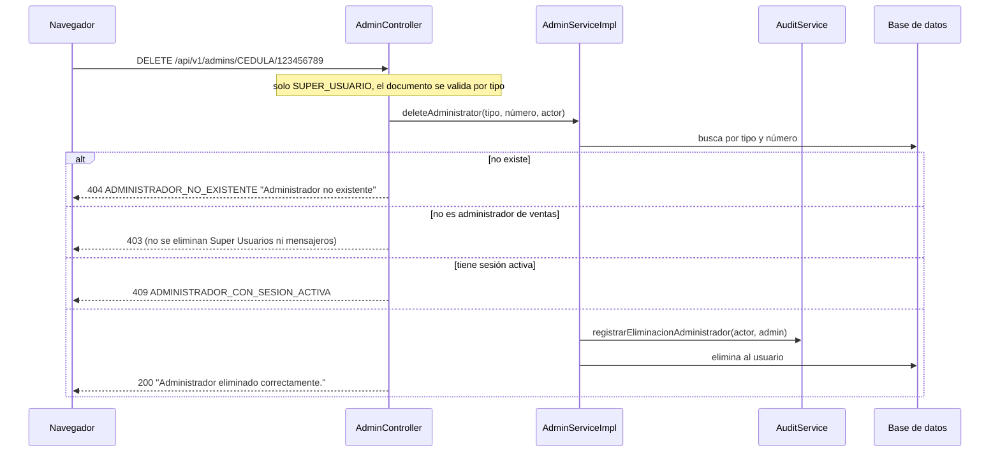

# HU008 · Eliminación de administradores

**Rama de correcciones:** `fix/hu008/criterios-aceptacion/silesky` (ID Azure DevOps #22), aún no fusionada.

## Resumen

El Super Usuario elimina a un administrador de ventas. La eliminación queda en el historial de auditoría y el
administrador pierde de inmediato todos sus accesos. No se puede eliminar a un administrador con una sesión
activa.

## Criterios de aceptación

| Criterio | Estado en `develop` |
|---|---|
| Solo el Super Usuario puede eliminar administradores | ✅ |
| Si no existe se muestra "Administrador no existente" | ✅ |
| No se elimina a un administrador con sesiones activas hasta que se cierren | ⚠️ Se bloquea, pero se considera "con sesión" a **todo** administrador `ACTIVE` |
| La eliminación queda en la auditoría con fecha, hora y usuario responsable | ⚠️ Falla (500) para administradores creados por la API |
| Al eliminarlo, pierde inmediatamente permisos y accesos | ✅ Borrado real: el filtro JWT ya no lo encuentra |

## Cómo funciona en el backend

Dos endpoints, ambos exclusivos del Super Usuario (`/api/v1/admins/**`), que identifican al administrador
por `documentType` y `documentNumber`:

- `GET /api/v1/admins/{documentType}/{documentNumber}/deletion-eligibility`: dice si se puede eliminar.
- `DELETE /api/v1/admins/{documentType}/{documentNumber}`: lo elimina.

- **Quién puede ser eliminado:** solo usuarios con rol `ADMIN_VENTAS`. Si el documento pertenece a otro rol,
  responde 403 y no borra nada.
- **Mismo número, distinto tipo:** el borrado usa siempre el par tipo + número, así que una cédula y un DIMEX
  con el mismo número son usuarios distintos.
- **Auditoría:** `registrarEliminacionAdministrador` guarda un registro `ELIMINAR_ADMINISTRADOR` con el actor,
  la fecha y un texto con el documento, el nombre y el correo del eliminado. Ese registro no se vincula al
  usuario borrado, para que la traza sobreviva a la eliminación.
- **Pérdida inmediata de acceso:** como el usuario se borra y el filtro JWT consulta al usuario en cada
  solicitud, su token deja de servir.
- **Sesión activa:** no hay un estado real de sesión (no existe logout en el backend). Se aproxima con la
  fecha del último inicio de sesión: dentro de la vigencia del JWT se considera que hay una sesión.

## Cómo funciona en el frontend

`AdminManagement` (`/main-menu/admins/delete`):

1. Lista los administradores (`GET /api/v1/admins`) y permite buscarlos por tipo y número de documento.
2. El botón de eliminar se deshabilita para quien tiene sesión activa (`hasActiveSession`).
3. Al elegir uno se abre `DeleteAdminModal` para confirmar; `deleteAdministrator(tipo, número)` llama al
   `DELETE`.
4. Los errores (404, 409) se muestran en el modal y en una notificación.

## Clases y archivos

### Backend

| Clase | Rol |
|---|---|
| `users.controller.AdminController` | Endpoints de listado, elegibilidad y eliminación. |
| `users.service.AdminService`, `impl.AdminServiceImpl` | `validateDeletionEligibility` y `deleteAdministrator`. |
| `users.dto.AdminDocumentRequest` | Enlaza y valida el tipo y número de documento de la ruta. |
| `users.dto.AdminDeletionEligibilityResponse`, `AdminDeletionResponse`, `AdminSummaryResponse` | Respuestas. |
| `users.service.AdminNotFoundException`, `users.exception.AdminSessionActiveException` | Errores de negocio (404 y 409). |
| `audit.service.AuditService`, `impl.AuditServiceImpl` | Registro de la eliminación. |
| `common.exception.GlobalExceptionHandler` | Traduce las excepciones al formato de error. |

### Frontend

| Archivo | Rol |
|---|---|
| `pages/AdminManagement.jsx` | Lista, búsqueda y flujo de eliminación. |
| `components/DeleteAdminModal.jsx` | Confirmación. |
| `services/AdminService.js` | `getAdministrators` y `deleteAdministrator`. |

## Pruebas

### Backend

| Test | Qué verifica |
|---|---|
| `AdminDeletionIntegrationTest` | El Super Usuario elimina a un administrador inactivo; documento inexistente da 404 sin auditoría; mensajero y administrador de ventas reciben 403; sin token, 401; no se elimina a un Super Usuario; un administrador con sesión activa se bloquea; mismo número con otro tipo; tipo o número de documento inválidos dan 400; la auditoría permanece tras eliminar. |
| `AdminDeletionEligibilityIntegrationTest` | La consulta de elegibilidad con y sin sesión reciente, documento inexistente (404) o inválido (400), mismo número con otro tipo, y el orden autorización antes que validación. |
| `AdminServiceImplTest` | Documento desconocido, usuario con otro rol, login nulo o vencido (elegible) y login reciente (bloquea y explica). |
| `AuditServiceTest` | El registro guarda actor, afectado, acción, detalle y fecha; el detalle se recorta a 500 caracteres; exige una transacción activa. |

### Frontend

No hay tests propios de `AdminManagement` ni de `DeleteAdminModal` en `develop`. La rama
`feature/hu006/t05/silesky` agrega `AdminManagement.test.jsx`.

## Limitaciones conocidas en `develop`

- **`hasActiveSession` de la eliminación** considera "con sesión" a cualquier administrador `ACTIVE`, aunque
  nunca haya iniciado sesión, mientras que el endpoint de elegibilidad usa solo el último inicio de sesión. No
  hay forma de inactivar administradores, así que en la práctica ninguno podría eliminarse.
- **Eliminar un administrador creado por la API da 500:** su registro `CREAR_ADMINISTRADOR` en la auditoría
  apunta a él con una clave foránea sin `ON DELETE`. Lo mismo ocurre con sus tokens de recuperación,
  historial de contraseñas y permisos individuales.
- Tres tests de esta HU (`AdminDeletion*`) fallan porque la columna heredada `cedula` sigue siendo `UNIQUE`,
  lo que impide que una cédula y un DIMEX compartan número. Lo corrige la rama `fix/bug/backend/silesky`
  (migración `V11`).

## Cambios pendientes en el PR abierto

- "Sesión activa" se define solo por el último inicio de sesión dentro de la vigencia del JWT, igual en la
  eliminación, la elegibilidad y el listado.
- `UserRelatedRecordsCleaner`: antes de borrar desvincula las auditorías del usuario afectado (se conservan)
  y elimina sus tokens de recuperación, historial de contraseñas y permisos individuales.
