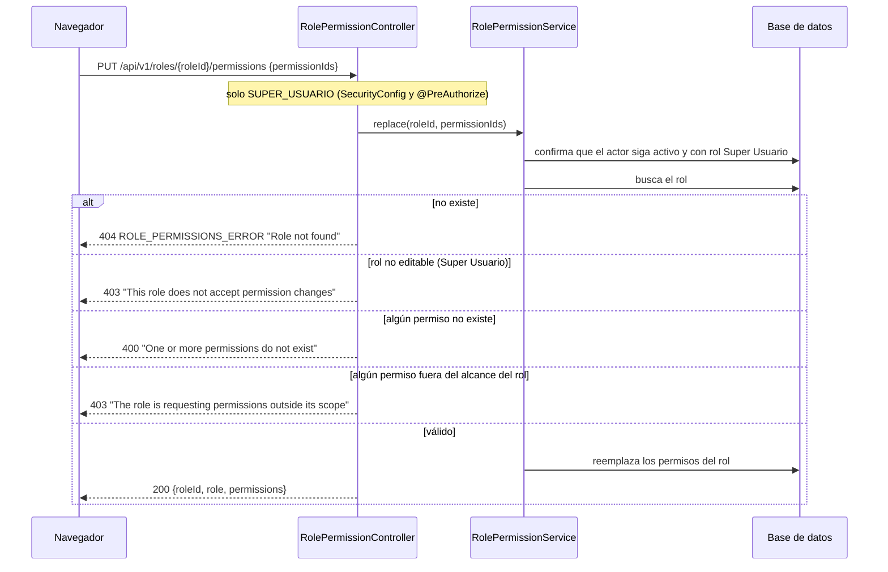

# HU009 · Roles y permisos

**Rama de correcciones:** `fix/hu009/criterios-aceptacion/silesky` (ID Azure DevOps #13), aún no fusionada.

## Resumen

El Super Usuario administra qué puede hacer cada rol. Los roles operativos (Administrador de Ventas y
Mensajero) tienen un conjunto de permisos que se puede ajustar dentro de su alcance; el Super Usuario no es
editable. Los cambios aplican en la siguiente solicitud de los usuarios afectados.

Referencia de la pantalla: [`docs/role-access-frontend-config.md`](../role-access-frontend-config.md) y colección de
Postman [`HU009-Task102`](../HU009-Task102.postman_collection.json).

## Criterios de aceptación

| Criterio | Estado en `develop` |
|---|---|
| Solo el Super Usuario asigna o modifica roles y permisos de los usuarios | ⚠️ Solo por rol; no hay nada por usuario |
| Si el usuario no existe: "Usuario no existente" | ❌ Solo existe "Role not found" |
| Los cambios aplican en la siguiente solicitud del usuario afectado | ⚠️ Aplica a los permisos del rol |
| La matriz impide que un rol operativo obtenga permisos restringidos | ⚠️ Al editar sí; los permisos sembrados no respetan el alcance |
| Opción para restablecer los permisos predeterminados del rol principal | ❌ Solo un botón local de la pantalla |
| Mensajero: consultar paquetes asignados, actualizar estado y registrar costos del viaje | ❌ El rol se siembra con otros permisos y sin el de costos |
| Administrador de Ventas: importar, consultar, asignar, exportar, reportes, etc. | ⚠️ Cubre 11 permisos; faltan códigos para varias capacidades |

## Cómo funciona en el backend

### Modelo

- `Role` ⟷ `Permission` (tabla `roles_permisos`): los permisos de cada rol.
- `UserPermission` (`usuarios_permisos`): excepción individual de un usuario sobre su rol (concedido o
  revocado). En `develop` existe la entidad y su repositorio, pero nada las usa.
- **Autoridades:** `UserPrincipal.getAuthorities()` devuelve `ROLE_<rol>` más los códigos de los permisos del
  rol. Se reconstruyen desde la base en cada solicitud, por eso un cambio de permisos del rol aplica en la
  siguiente petición sin emitir un token nuevo.

### Matriz por rol

**Alcance por rol** (`OPERATIONAL_PERMISSIONS` en `RolePermissionService`):

| Rol | Permisos que puede tener |
|---|---|
| Administrador de Ventas | importar, eliminar, consultar, buscar, exportar y generar QR de paquetes; asignar paquetes; consultar y imprimir reportes; consultar comprobantes y costos |
| Mensajero | consultar paquetes asignados, actualizar el estado de paquetes y registrar costos del viaje |
| Super Usuario | no editable |

### Siembra de roles

`RoleDataInitializer` corre al arrancar (`@Order(1)`) y crea los permisos y los tres roles. En `develop`
reasigna los permisos de cada rol en **cada arranque**, así que las ediciones guardadas se pierden al
reiniciar, y los valores sembrados de Administrador de Ventas y Mensajero no coinciden con su alcance.

## Cómo funciona en el frontend

`RoleAccessManagement` (`/gestion-roles`):

- Un buscador de mensajero por número de documento (solo muestra una vista previa; no cambia lo que se edita).
- La **matriz de control de acceso** con los tres perfiles: Super Usuario (permisos fijos), Administrador de
  Ventas y Mensajero (interruptores editables).
- **Restablecer predeterminados:** vuelve el formulario a los valores del catálogo local
  (`config/roleAccessCatalog.js`); no llama al backend.
- **Aplicar cambios:** recorre los roles editados y llama a `replaceRolePermissions` para cada uno.

En `develop` este botón no puede guardar: envía el nombre del rol como `roleId` y los códigos de permiso como
`permissionIds`, mientras que el backend espera ids numéricos.

## Clases y archivos

### Backend

| Clase | Rol |
|---|---|
| `users.controller.RolePermissionController` | `PUT /api/v1/roles/{roleId}/permissions`. |
| `users.service.RolePermissionService` | Reglas de la matriz por rol. |
| `users.service.RolePermissionException` | Errores del módulo con su estado HTTP. |
| `users.bootstrap.RoleDataInitializer` | Siembra de permisos y roles. |
| `users.constant.PermissionCode`, `RoleName` | Códigos de permisos y nombres de rol. |
| `users.model.Role`, `Permission`, `UserPermission` y sus repositorios | Modelo de datos. |
| `auth.security.UserPrincipal` | Construye las autoridades del usuario. |

### Frontend

| Archivo | Rol |
|---|---|
| `pages/RoleAccessManagement.jsx` (+ `.css`) | Pantalla de la matriz. |
| `config/roleAccessCatalog.js` | Catálogo de perfiles y permisos. |
| `services/RoleAccessService.js` | Llamada al backend. |

## Pruebas

### Backend

| Test | Qué verifica |
|---|---|
| `RolePermissionIntegrationTest` | El Super Usuario reemplaza permisos y se persisten; se rechaza un permiso administrativo sin cambiar el rol; se permite uno operativo de Administrador de Ventas; una lista vacía revoca todos; el mensajero y las solicitudes sin token se bloquean; un token de un Super Usuario que perdió el rol o quedó inactivo no autoriza; se validan los ids y no se edita al Super Usuario; `DataSeeder` conserva los permisos editados, migra el correo anterior del Super Usuario, actualiza su nombre y permite iniciar sesión con el correo nuevo. |
| `RolePermissionAuthorizationBeforeValidationTest` | Los roles sin permiso reciben 403 (no 400) con cuerpo inválido, malformado o `roleId` de tipo incorrecto; sin token, 401. |
| `UserPermissionRepositoryTest` | El repositorio guarda concesiones y revocaciones individuales sin tocar los permisos del rol. |
| `JwtIntegrationTest` | Un token existente usa los permisos actualizados en cada solicitud. |

### Frontend

No hay tests propios de `RoleAccessManagement` en `develop`.

## Limitaciones conocidas en `develop`

- No existe asignación de permisos por usuario ni restablecimiento en el backend; no hay mensaje "Usuario no
  existente".
- Los permisos sembrados de Mensajero incluyen consultar y buscar paquetes, comprobantes y costos, y le falta
  registrar costos del viaje; Administrador de Ventas recibe además permisos de gestión de usuarios y los del
  mensajero.
- El inicializador pisa las ediciones en cada arranque.
- La pantalla no puede guardar por el contrato incorrecto, y varios permisos del catálogo (validar importación,
  duplicados, consultas por mensajero y por estado, notificaciones) no existen en el backend.

## Cambios pendientes en el PR abierto

- `GET`, `PUT` y `DELETE /api/v1/users/{tipo}/{número}/permissions`: consulta, modifica y restablece los
  permisos de un usuario como excepciones sobre su rol, dentro del alcance del rol. Usuario inexistente: 404
  `USUARIO_NO_EXISTENTE` ("Usuario no existente"). Se audita con `ACTUALIZAR_PERMISOS_USUARIO` y
  `RESTABLECER_PERMISOS_USUARIO`.
- `UserDetailsServiceImpl` carga las excepciones en cada solicitud y `UserPrincipal` las aplica: el efecto es
  inmediato en la siguiente solicitud del usuario.
- `RolePermissionDefaults` como única fuente de los permisos predeterminados y del alcance; el inicializador
  siembra solo los roles nuevos y retira lo que esté fuera de alcance, sin pisar las ediciones.
- La pantalla pasa al flujo por usuario: buscar por tipo y número de documento, ver su matriz, guardar y
  restablecer contra los endpoints nuevos.
