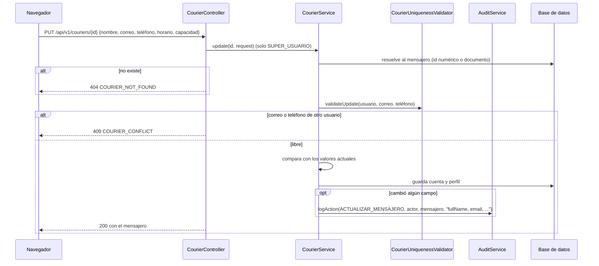

# HU004 · Edición de mensajeros

**Rama de correcciones:** `fix/hu004/criterios-aceptacion/silesky` (ID Azure DevOps #6), aún no fusionada.

## Resumen

El Super Usuario busca a un mensajero por su documento y edita su nombre, correo, teléfono, horario y
capacidad máxima de carga. Cada edición queda en un historial con la fecha, la hora y los campos
modificados.

## Criterios de aceptación

| Criterio | Estado en `develop` |
|---|---|
| Cualquier cambio en el estado de acceso cierra de inmediato la sesión activa del mensajero | ❌ El `PUT` no recibe el estado; el interruptor de la pantalla solo muestra un aviso |
| El cambio de estado se hace antes de tener envíos en proceso y solo fuera de labores | ⚠️ Existe la validación de asignaciones (`CourierDeactivationValidator`) pero no se usa; la pantalla bloquea con datos que el backend no envía |
| Historial de modificaciones con fecha, hora y campos modificados | ⚠️ El backend audita cada edición, pero no hay endpoint para leerla; la pantalla arma su propio log en memoria |
| La capacidad máxima de carga es un valor numérico positivo | ✅ |
| La búsqueda funciona sin importar el tipo de documento | ⚠️ El backend busca por número; el filtro de la pantalla exige el mismo tipo de documento |

## Cómo funciona en el backend

- **Auditoría:** el detalle guarda solo los **nombres** de los campos que cambiaron (por ejemplo
  `fullName, schedule`), nunca sus valores anteriores ni nuevos, ni la contraseña. Si el cuerpo no cambia
  nada, responde 200 sin registrar. Se guarda en la misma transacción: si la auditoría falla, se revierte
  la edición.
- **Documento no editable:** el `PUT` no incluye documento, rol ni estado.
- **Comparaciones de capacidad:** `25.5` y `25.50` cuentan como el mismo valor.

## Cómo funciona en el frontend

`EditMessenger` (`/editar-mensajero`):

1. **Búsqueda** por tipo y número de documento sobre la lista de mensajeros (`GET /api/v1/couriers`).
2. **Formulario** con nombre, correo, teléfono, horario y capacidad; valida que la capacidad sea positiva.
3. **Guardar** envía `PUT /api/v1/couriers/{documento}` con los datos editados.
4. **Interruptor de estado de acceso:** se bloquea si el mensajero está en labores o tiene envíos en proceso
   (datos que hoy el backend no entrega) y avisa que la sesión se cerrará de inmediato.
5. **Historial:** se arma en el navegador con la fecha, la hora y los campos modificados; se pierde al
   recargar la página.

## Clases y archivos

### Backend

| Clase | Rol |
|---|---|
| `couriers.controller.CourierController` | `PUT /api/v1/couriers/{id}` y `GET /api/v1/couriers`. |
| `couriers.service.CourierService` | `update` (resolución del mensajero, unicidad, auditoría) y `list`. |
| `couriers.service.CourierUniquenessValidator` | Correo y teléfono no pertenecen a otro usuario. |
| `couriers.dto.UpdateCourierRequest` | Datos editables. |
| `audit.service.AuditService`, `audit.model.AuditLog`, `AuditAction.COURIER_UPDATED` | Registro de la edición. |
| `couriers.service.CourierDeactivationValidator` | Existe para desactivar, sin uso aún en esta HU. |

### Frontend

| Archivo | Rol |
|---|---|
| `pages/EditMessenger.jsx` | Búsqueda, formulario, estado y log. |
| `services/CourierService.js`, `hooks/useCourier.js` | Llamadas al backend. |

## Pruebas

### Backend

| Test | Qué verifica |
|---|---|
| `CourierUpdateTest` | El Super Usuario actualiza los datos; repetir el mismo correo y teléfono no da conflicto; el correo o teléfono de otro usuario se rechaza; documento inexistente da 404; otros roles no pueden; datos inválidos se rechazan sin cambiar nada. |
| `CourierUpdateAuditTest` | Cinco campos modificados generan un registro con actor, afectado, fecha y detalle; el detalle indica solo los campos cambiados y en orden; un cuerpo idéntico o con peso numéricamente equivalente no registra nada; el detalle no contiene hashes ni valores; los errores (404, 409, 400, 403) no registran nada. |
| `CourierUpdateAtomicityTest` | Si la auditoría falla se revierte el cambio del mensajero. |
| `CourierListTest`, `CourierRepositoryFindAllTest` | El listado ordena por nombre, incluye inactivos y carga la cuenta sin sesión abierta; solo lo ve el Super Usuario. |
| `CourierDeactivationValidatorTest`, `ProvisionalCourierWorkloadPortTest` | La validación lanza una excepción con asignaciones activas; el puerto provisional siempre responde "sin asignaciones". |

### Frontend

| Test | Qué verifica |
|---|---|
| `EditMessenger.test.jsx` | Título, buscador y formulario precargado; capacidad positiva; bloqueo del cambio de estado con envíos en proceso; envío de la petición de actualización; registro del historial; notificaciones de éxito y error. |

## Limitaciones conocidas en `develop`

- `UpdateCourierRequest` no incluye el estado: no existe forma de cambiar el estado de acceso desde la edición.
- `ProvisionalCourierWorkloadPort` siempre responde que no hay asignaciones activas (a la espera del módulo
  de paquetes, Task #301).
- El documento se resuelve por `Long.valueOf` primero, así que una cédula de solo dígitos se interpreta como
  id de mensajero.

## Cambios pendientes en el PR abierto

- `PATCH /api/v1/couriers/{id}/status`: activa o desactiva, sube `tokenVersion` (la sesión activa deja de
  ser válida en su siguiente solicitud), valida las asignaciones (409 `COURIER_HAS_ACTIVE_ASSIGNMENTS`) y
  audita `ACTIVAR_MENSAJERO` / `DESACTIVAR_MENSAJERO`.
- `GET /api/v1/couriers/{id}/history`: historial con fecha, hora, campos y autor; la pantalla lo lee del
  backend en lugar de armarlo en memoria.
