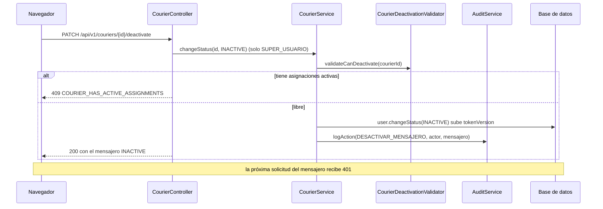

# HU005 · Desactivación de mensajeros

**Rama de correcciones:** `fix/hu005/criterios-aceptacion/silesky` (ID Azure DevOps #7), aún no fusionada.
Está apilada sobre la de HU004: reutiliza su cambio de estado y su historial.

## Resumen

El Super Usuario desactiva a un mensajero: pierde el acceso al sistema pero su registro y su historial de
entregas se conservan. Antes de desactivar se pide confirmación, y no se puede desactivar a un mensajero
con paquetes o entregas pendientes.

## Criterios de aceptación

| Criterio | Estado en `develop` |
|---|---|
| Solo el Super Usuario puede desactivar mensajeros | ✅ Backend (403 a otros roles) y menú |
| El sistema solicita confirmación antes de desactivar | ✅ `DeactivateMessengerModal` |
| Un mensajero desactivado no puede recibir nuevas asignaciones | ⏳ Depende del módulo de paquetes (Task #301) |
| Los paquetes pendientes deben reasignarse manualmente | ⏳ Depende del módulo de paquetes (Task #301) |
| El historial de entregas se conserva | ✅ La desactivación es lógica, no borra nada |
| Se identifica al mensajero por su documento (cédula, DIMEX o pasaporte) | ✅ Búsqueda por tipo y número |
| **Funcionamiento del botón "Sí, desactivar"** | ❌ Llama a `PATCH /api/v1/couriers/{id}/deactivate`, que no existe en el backend |

## Cómo funciona

### Backend

En `develop` solo existen las piezas de apoyo:

- `CourierDeactivationValidator.validateCanDeactivate(courierId)` consulta a `CourierWorkloadPort` y lanza
  `CourierHasActiveAssignmentsException` si el mensajero tiene asignaciones activas (cualquier estado
  distinto de Entregado y No entregado).
- `ProvisionalCourierWorkloadPort` es la implementación provisional del puerto: siempre responde que no hay
  asignaciones, porque el módulo de paquetes todavía no existe.
- `User.changeStatus(INACTIVE)` cambia el estado y sube `tokenVersion`, lo que invalida las sesiones activas.

Nada del módulo de mensajeros llama a esas piezas todavía: falta el endpoint que las junte.

### Flujo con el PR abierto

### Frontend

- **`MessengerFleetList`** (`/main-menu/couriers/deactivate`): lista los mensajeros, permite buscarlos por tipo
  y número de documento y abre el modal con "Desactivar". Un mensajero inactivo muestra el botón
  deshabilitado.
- **`DeactivateMessengerModal`:** pide confirmación ("Sí, desactivar" o "Cancelar"), avisa que perderá el
  acceso de inmediato y muestra el error del backend; un 409 se muestra como advertencia.
- **`useDeactivateMessenger`:** llama a `deactivateCourier(id)`; un 401 cierra la sesión.
- La pantalla muestra siempre "Fuera de labores" y "Sin envíos en proceso" como texto fijo, porque el
  backend aún no entrega esos datos.

## Clases y archivos

### Backend

| Clase | Rol |
|---|---|
| `couriers.service.CourierDeactivationValidator` | Regla: no se desactiva con asignaciones activas. |
| `couriers.service.CourierWorkloadPort`, `ProvisionalCourierWorkloadPort` | Consulta de la carga de trabajo (provisional). |
| `couriers.service.CourierHasActiveAssignmentsException` | Error de la regla anterior. |
| `users.model.User` | `changeStatus` sube `tokenVersion`. |
| `audit.model.AuditAction.COURIER_DEACTIVATED` | Código de auditoría `DESACTIVAR_MENSAJERO` (reservado). |

### Frontend

| Archivo | Rol |
|---|---|
| `components/MessengerFleetList.jsx` | Pantalla con lista, búsqueda y auditoría de la sesión. |
| `components/DeactivateMessengerModal.jsx` | Confirmación de la desactivación. |
| `hooks/useDeactivateMessenger.js`, `services/CourierService.js` | Llamada al endpoint. |

## Pruebas

### Backend

| Test | Qué verifica |
|---|---|
| `CourierDeactivationValidatorTest` | Lanza la excepción con asignaciones activas, no lanza sin ellas y consulta al puerto con el mismo id recibido. |
| `ProvisionalCourierWorkloadPortTest` | El puerto provisional responde "sin asignaciones" para cualquier mensajero. |
| `CourierAuthorizationBeforeValidationTest` | Los roles sin permiso reciben 403 también en la ruta de desactivación, aunque el id sea inválido. |
| `SessionInvalidationIntegrationTest` | Cambiar el estado de una cuenta invalida su token en la siguiente solicitud. |

### Frontend

No hay tests propios de `MessengerFleetList` ni del modal en `develop`.

## Limitaciones conocidas en `develop`

- El endpoint `/deactivate` no existe: el botón termina en error.
- La "Auditoría de desactivaciones" de la pantalla es solo del navegador (se pierde al recargar).
- La regla de asignaciones activas es provisional hasta que exista el módulo de paquetes.

## Cambios pendientes en el PR abierto

- `PATCH /api/v1/couriers/{id}/deactivate` delega en el cambio de estado de HU004: cierra la sesión,
  valida las asignaciones, audita y conserva la cuenta y el perfil.
- La pantalla toma la fecha, la hora y el autor de la auditoría del backend.
- Tests nuevos de la pantalla (confirmar, desactivar por id y 409) y del endpoint (sesión cerrada, 409 y
  permisos).
